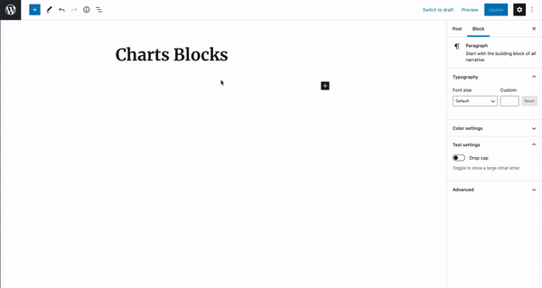
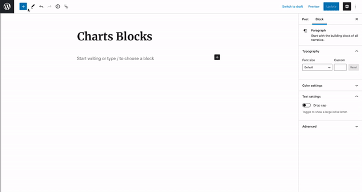

# Charts Blocks for Gutenberg

Charts Blocks for Gutenberg is a WordPress plugin for creating responsive, interactive and animated charts in just two simple clicks.\
Select a Chart Block, Upload your CSV file and DONE. It's that easy!

### [Download Plugin](https://wordpress.org/plugins/charts-blocks/)

Bar Chart Example:

Pie Chart Example:

### 🧰 &nbsp;Built with

- <a target="_blank" href="https://reactjs.org/" >React</a>
- <a target="_blank" href="https://www.chartjs.org/" >ChartJS</a>
- <a target="_blank" href="https://sass-lang.com/" >PHP</a>
- <a target="_blank" href="https://pages.github.com/" >WordPress</a>

### 👨‍💻 &nbsp;How to use

Select a Chart Block from the availabe chart types. Currently there are 6 different Chart Blocks:

1. Bar Chart Block
2. Line Chart Block
3. Pie Chart Block
4. Doughnut Chart Block
5. Horizontal Bar Chart Block
6. Horizontal Line Chart Block

Upload your CSV file and TADAA!

Your Beautiful, Animated and Responsive chart is ready for the world!

### 🤝&nbsp;Contributing

1. Fork it
2. Create your feature branch (`git checkout -b feature/fooBar`)
3. Commit your changes (`git commit -am 'Add some fooBar'`)
4. Push to the branch (`git push origin feature/fooBar`)
5. Create a new Pull Request
